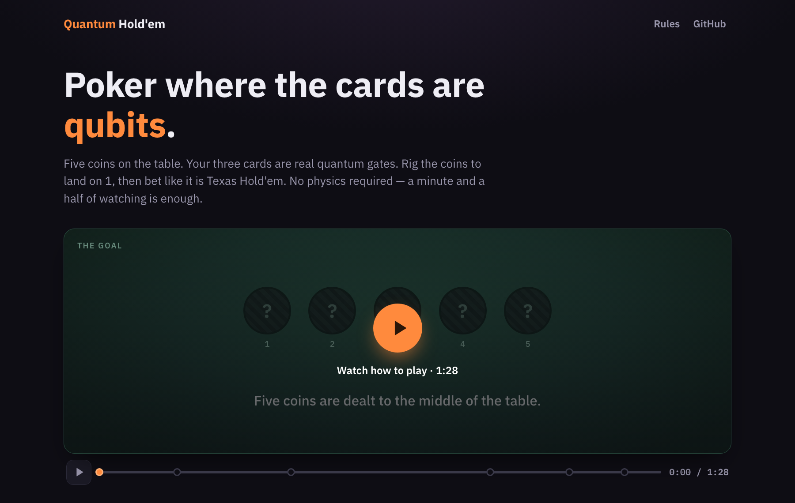
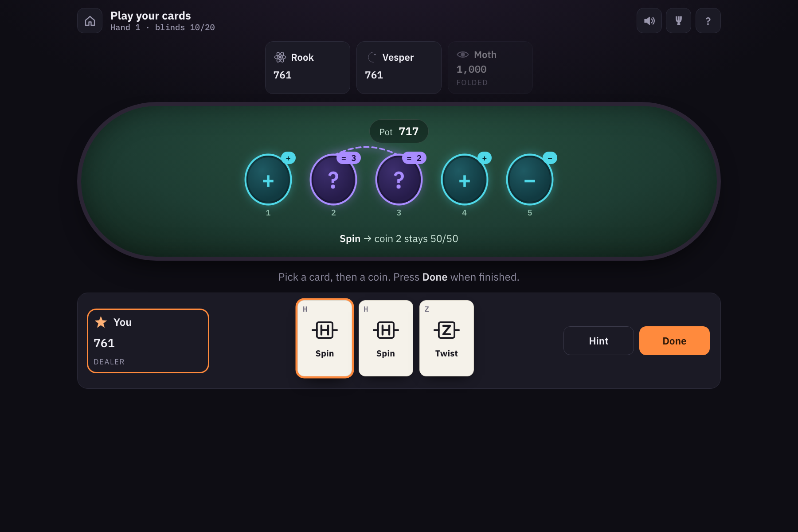
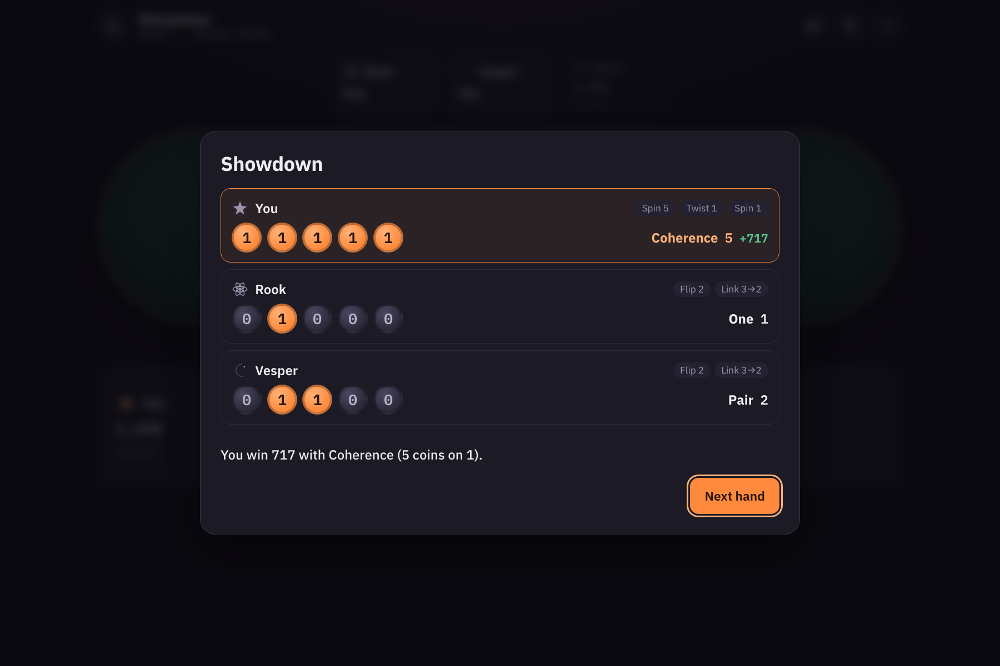

# Quantum Hold'em

**Texas Hold'em where the community cards are qubits and your hand is a set of quantum gates.**
Runs entirely in the browser. No install, no account, no physics required.

Built for **IBM Quantum Fall Fest 2026**, on the rules of *Quantum Poker* by Fuchs, Falch and
Johnsen (SINTEF) — see [Credits](#credits).



---

## Play it

```bash
git clone https://github.com/abenehra21/QuantumPoker.git
cd QuantumPoker
python3 -m http.server 8000     # then open http://localhost:8000
```

(Opening `index.html` straight from disk works too.) It is a static site, so it deploys anywhere:
turn on GitHub Pages for the repository and it is live.

Three ways to play:

| Mode | What it is |
|---|---|
| **Daily Deal** | Ten hands against three bots. Everyone in the world gets the same deals today. Share your result as an emoji grid, keep a streak. |
| **Quick game** | One to four bots, play until someone busts. Copy a challenge link and a friend gets the exact same deals. |
| **Pass & play** | Two to five people on one device. The screen covers itself between turns. |

The home page has an 88-second **how-to-play film**. It is not a video file: every frame is the
game's own coins and cards animated from a cue list, so it is sharp on any screen and its captions
are real text. Most people can play after watching it once.

---

## The rules in one minute

**Five coins** are dealt to the middle of the table. At showdown every coin lands on a **1** or a
**0**. Each 1 is a point. Most points takes the pot. In between, you bet chips exactly as in Hold'em.

### Reading a coin

| Coin | Means | Odds of a 1 |
|---|---|--:|
| **1** | Settled on 1. A sure point. | 100% |
| **0** | Settled on 0. Worth nothing unless you change it. | 0% |
| **spinning +** | Undecided — a qubit in superposition, tilted `+`. | 50% |
| **spinning −** | Undecided, tilted `−`. The tilt decides what your cards do to it. | 50% |
| **linked** | Entangled with another coin. They always land the same, or always opposite. | 50% |

### Your cards

Three per hand, dealt before the first bet. Each is a quantum gate.

| Card | Does | Gate |
|---|---|---|
| **Flip** | Turns 0 into 1 and 1 into 0. A spinning coin ignores it. | `X` |
| **Spin** | Spins a settled coin. Stops a spinning one: `+` lands on 0, `−` lands on 1. | `H` |
| **Twist** | Turns a `+` spin into `−` and back. Does nothing to a settled coin. | `Z` |
| **Link** | If the first coin is 1, flips the second. If it is spinning, links the two. | `CNOT` |
| **Collapse** | Lands a spinning coin right now, on your board. You can still play on it. | measure |

Some lines worth knowing: a `−` coin is one Spin from a point; a `+` coin is Twist-then-Spin;
Collapse a coin toss and Flip it if it lands wrong; Flip one coin of a linked pair and exactly one
of them is guaranteed to land 1. With a card selected, hovering a coin tells you precisely what will
happen before you commit, and **Hint** plays the best card for you.

### A hand

1. **Deal** — blinds, three cards each, first bets. No coins showing yet: you are betting on your cards.
2. **Flop** — three coins turn over. Bets.
3. **Turn** — a fourth. Bets.
4. **River** — the fifth. Last bets.
5. **Cards** — everyone still in plays cards on **their own copy** of the five coins.
6. **Showdown** — every copy lands. Count the 1s.

| 1s | Rank |
|--:|---|
| 0 | Blank |
| 1 | One |
| 2 | Pair |
| 3 | Trips |
| 4 | Quads |
| 5 | **Coherence** |

Tied on count? A 1 further left wins — coin 1 is the ace. Identical boards split the pot.
Blinds double every five hands, so a game ends.



---

## Why it is a quantum project and not just a theme

The coins are qubits and the cards are the gates a physicist would write on a circuit — the card
art *is* the circuit notation. Nothing is faked:

- `js/quantum.js` is an exact **state-vector simulator**: 2ⁿ complex amplitudes with the real
  `X`, `Z`, `H` and `CNOT` matrices applied to them. Every probability on the table is the genuine
  quantum answer.
- Spinning is **superposition**; the ± tilt is **relative phase**, which is invisible until a gate
  turns it into an outcome (Spin landing `+` on 0 and `−` on 1 is **interference**).
- Linked coins are **Bell pairs**. The table detects them by projecting each pair onto the four
  Bell states, and draws the arc only when the overlap is exactly 1.
- Collapse is a **projective measurement**: the branch that disagrees is zeroed and the rest
  renormalised, which is why it destroys any link through that coin.
- Press **Ψ** at the table and every coin shows its ket and P(1), the read-out shows ⟨n⟩, and each
  card shows its gate.

The **Hint** button and the bots share one planner (`Engine.plan`): an exhaustive search over every
order and target of the cards in hand, with Collapse branching on both outcomes weighted by their
probability. It runs in a few milliseconds and never suggests a play that changes nothing.



---

## What is in here

```
index.html          the page: home, table, overlays
css/style.css       the look
js/quantum.js       state-vector simulator, coin reading, board dealing
js/engine.js        chips, streets, betting, side pots, cards, planner, showdown
js/bots.js          four opponents with personalities; betting decisions
js/explainer.js     the how-to-play film: a cue timeline, not a video
js/art.js           gate glyphs, avatars, coin and card DOM builders
js/sound.js         sound effects synthesised with WebAudio (no audio files)
js/ui.js            screens, interaction, daily deal, stats, sharing
js/tests.js         60 self-checks
docs/               screenshots
Python/             the original Qiskit implementation (see Credits)
```

Nothing is loaded from anywhere except two fonts. There is no build step and no dependency.

### Self-checks

```bash
node js/tests.js
```

or open `index.html?test` in a browser. They verify the gate table against the rules text,
probability conservation over thousands of random gates, that linked coins always land together,
that Collapse is a fair toss which drags its partner with it, that the planner finds the right
lines and never opens with busywork, side pots, the kicker rule, that thirty bot-played games
conserve every chip and always end, that a Daily Deal deals identically no matter how anyone
plays it, and that the explainer never shows a card or coin the game does not have.

### Determinism

Every hand's board and cards come from `mix(seed, handNo)` alone, so a seed replays the same deals
regardless of what anyone does with them. The Daily Deal seed is the day number; a challenge link
is `?seed=…&bots=…`.

---

## Credits

Quantum Poker was designed by **Franz G. Fuchs**, **Vemund Falch** and **Christian Johnsen** at
[SINTEF](https://www.sintef.no/). The idea — community cards as qubits, hole cards as gates, each
player rigging their own copy of the board — is theirs:

> Fuchs, Falch and Johnsen, *"Quantum Poker – a game for quantum computers suitable for
> benchmarking error mitigation techniques on NISQ devices"*, The European Physical Journal Plus
> **135**, 353 (2020). [doi:10.1140/epjp/s13360-020-00360-5](https://doi.org/10.1140/epjp/s13360-020-00360-5)

Their original Qiskit implementation is kept in [`Python/`](Python/) (`pip install -r requirements.txt`,
then `python Python/runPoker.py`). This browser version — the coin metaphor, the five named cards,
the bots, the Daily Deal, the explainer and the simulator — is a rewrite on top of their rules.

Licensed under the GNU GPL v3, like the original.
