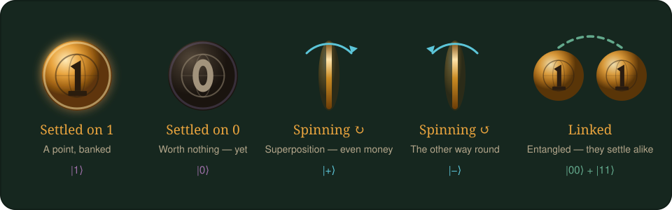

# 🎃 Candy Coven

**Quantum poker, played for candy.** Built for **IBM Quantum Fall Fest 2026**.

Five cursed coins sit on the table. At the end of the hand they all land. Every coin
that lands face-up is a point, most points takes the pot, and the pot is made of
chocolate. You bet, you bluff, you fold — exactly like poker.

The coins are real qubits and the cards are real quantum gates. You will not be told
that while you play unless you ask.



---

## Play it

No install, no build step, no server. Clone and open the file:

```bash
git clone https://github.com/abenehra21/QuantumPoker.git
cd QuantumPoker
open index.html          # or: python3 -m http.server, then visit localhost:8000
```

It runs entirely in the browser — two to five players, one device, passed around the
table. There is nothing to sign into and no IBM Quantum account needed; the quantum
mechanics is simulated locally in about sixty lines of JavaScript.

First time? Hit **60-second tutorial** on the title screen. It is two coins, two cards,
and no jargon.

> Playing on a laptop with a projector works well for a crowd; playing on one phone
> passed around the table works better for four friends and a bowl of sweets.

---

## The candy

Everyone starts with **200 points** of real, physical candy:

| Sweet | Worth | You start with |
|---|--:|--:|
| Chocolate bar | 25 | 4 |
| Fun-size bar | 10 | 5 |
| Lollipop | 5 | 6 |
| Candy corn | 1 | 20 |

The app keeps score. The candy moves for real. Blinds start at 5/10 and **double every
six hands**, so a table finishes in twenty minutes or so instead of passing the same
lollipop around until midnight.

When someone finally busts, the **Settle up** screen tells you exactly which sweets
change hands — and it only ever hands out candy the table actually brought.

---

## The coins

Never mind kets and amplitudes. A coin is in one of four states, and you can see which
at a glance:

| Coin | Means | Odds |
|---|---|---|
| 🎃 **Face-up** | Locked. A point in your pocket. | 100% |
| 💀 **Skull** | Dead. Worthless unless you flip it. | 0% |
| ↻ **Spinning clockwise** | Still in the air. | 50% |
| ↺ **Spinning counter-clockwise** | Also still in the air — but the other way round. | 50% |

Which way a coin spins matters, because it decides which card can catch it.

Two coins can also be **chained**, drawn with a glowing link between them. Chained coins
always land the same way up — or always opposite. Chain a coin you can control to one
you cannot, and you get two points for the price of one.

---

## Your cards

Three cards each, dealt face-down, played after the last round of betting.

| Card | Does |
|---|---|
| 🦇 **Flip** | Turns a resting coin over. A spinning coin shrugs it off. |
| 👻 **Haunt** | Sets a resting coin spinning — or stops one that already is. |
| 🕯️ **Summon** | Catches a **clockwise** spin face-up. Your best card. |
| ⛓️ **Bind** | Chains two coins so they land together — or snaps a chain. |

Flip, Haunt and Bind undo themselves: play one twice on the same coin and nothing has
happened. **Summon is different.** It walks a coin around a four-step loop —
dead → ↻ → face-up → ↺ — so a second Summon on the same coin throws away the point you
just won.

Hovering a card over a coin tells you the exact outcome before you commit. If you would
rather not think, the **Hint** button plays the best card for you.

---

## A hand, start to finish

1. **The Summoning** — blinds go in, cards are dealt face-down, first round of betting.
   No coins on the table yet; you are betting on nerve.
2. **The Reveal** — three coins turn over. Bet again.
3. **The Turning** — a fourth coin. Bet again.
4. **The Witching Hour** — the fifth and last coin. Final bet.
5. **Cards on the coins** — each player in turn plays whatever cards they like on
   *their own* copy of the board, behind a privacy curtain.
6. **Showdown** — every coin lands, one at a time. Count the face-ups.

| Face-up | Rank |
|--:|---|
| 0 | Ash |
| 1 | Ember |
| 2 | Flicker |
| 3 | Blaze |
| 4 | Inferno |
| 5 | **Blood Moon** |

---

## For the physicists

Press **ψ** at any time. Nerd Mode overlays the actual states — |0⟩, |1⟩, |+⟩, |−⟩, the
exact probabilities, and the gate behind each card:

| Card | Gate |
|---|---|
| Flip | `X` |
| Haunt | `H` |
| Summon | `ZH` |
| Bind | `CNOT` |

Spinning is superposition, spin direction is relative phase, and chained is a Bell pair.
`js/quantum.js` is an exact state-vector simulator — 2ⁿ complex amplitudes with the real
unitaries applied to them, no shortcuts — so everything the table shows you is the true
quantum answer, including the entanglement detection, which projects each pair onto the
four Bell states.

Append `?seed=28521` to the URL to replay a specific game, and `?test` to run the
self-checks.

---

## What is in here

```
index.html          the game
css/style.css       the table
js/quantum.js       state-vector simulator + board dealing
js/engine.js        candy, betting rounds, side pots, showdown
js/ui.js            screens and interaction
js/tests.js         43 self-checks — open index.html?test
Python/             the original Qiskit implementation (see below)
```

### Running the checks

Open **[index.html?test](index.html?test)** in a browser. It verifies the gate algebra
against the coin metaphor, that probability is conserved across ten thousand random
gates, that chained coins really do always land together, that side pots split correctly,
and that 60 bot-played games conserve every last piece of candy.

---

## Credits and original work

Candy Coven is a reskin of **Quantum Poker**, designed and written by **Franz G. Fuchs**,
**Vemund Falch** and **Christian Johnsen** at [SINTEF](https://www.sintef.no/). The game
design and the quantum mechanics behind it are entirely theirs. What is new here is the
presentation: the coin metaphor, the Halloween table, the candy stakes, and a browser
implementation that needs no Python.

**The paper:**

> Franz G. Fuchs, Vemund Falch and Christian Johnsen,
> *"Quantum Poker – a game for quantum computers suitable for benchmarking error
> mitigation techniques on NISQ devices"*,
> The European Physical Journal Plus **135**, 353 (2020).
> [doi:10.1140/epjp/s13360-020-00360-5](https://doi.org/10.1140/epjp/s13360-020-00360-5)
> · [arXiv:1908.00044](https://arxiv.org/abs/1908.00044)

```bibtex
@article{fuchs2020quantumpoker,
  title   = {Quantum Poker -- a game for quantum computers suitable for
             benchmarking error mitigation techniques on NISQ devices},
  author  = {Fuchs, Franz G. and Falch, Vemund and Johnsen, Christian},
  journal = {The European Physical Journal Plus},
  volume  = {135},
  number  = {4},
  pages   = {353},
  year    = {2020},
  doi     = {10.1140/epjp/s13360-020-00360-5},
  eprint  = {1908.00044},
  archivePrefix = {arXiv},
  primaryClass  = {quant-ph}
}
```

**The original project:**
[github.com/sintefmath/QuantumPoker](https://github.com/sintefmath/QuantumPoker).

### The original implementation lives on

`Python/` still holds the authors' Qiskit version, ported to run on current libraries
(Qiskit 2.x, NumPy 2.x, Matplotlib 3.x). It is the reference implementation and the one
tied to the paper's error-mitigation benchmarking, so it has been left intact rather than
replaced:

```bash
python -m pip install -r requirements.txt
python Python/runPoker.py
```

The notebook [Python/runPokerJN.ipynb](Python/runPokerJN.ipynb) walks through a complete
round with the physics explained properly. If Candy Coven gets someone curious, that is
where to send them next.

### What changed in the browser version

The rules are the same game; the framing is not.

- Qubits became coins, gates became cards, and every ket moved behind the ψ toggle.
- The +/− basis toggle and the Bell-state inspector panels are gone — spin direction and
  a drawn chain say the same thing without a control panel.
- The unused `CH`, `SWAP`, `CCX`, `SRX`, `SRZ` and `Z` gates were dropped; the deck was
  always just four cards.
- Betting is now for candy, with escalating blinds and a settle-up screen.
- Hands got names, the showdown got an animation, and the rules got a tutorial.

---

## License

GNU General Public License v3.0, the same as the original project. The per-file copyright
headers naming the original authors have been left where they are.
